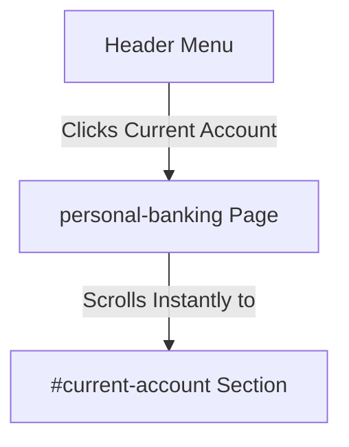

# Proposal: Routing Architecture Redesign & Loading States

A professional design and architectural proposal to transition the Atwima Community Bank platform from anchor-scrolling layouts to a modern, multi-page routing structure with skeleton loading transitions.

---

## 1. Executive Summary

The current application utilizes a single-page section scrolling approach via hashes (e.g. `/personal-banking#savings-account`). While this keeps layouts compact, it makes the platform feel like a single long scrolling page, which can degrade UX, dilute SEO focus per product, and cause abrupt visual jumps.

This proposal outlines a strategy to:
1. **Deconstruct multi-section pages** into distinct, specialized sub-routes.
2. **Introduce Next.js route-level loading skeletons** (`loading.js`) to provide immediate feedback on navigation.
3. **Implement page transition animations** for fluid page switches instead of harsh scrolling jumps.

---

## 2. Current Architecture vs. Proposed Architecture

### Current Structure (Anchor Jumps)


### Proposed Structure (Distinct Routes & Loading Skeletons)
```mermaid
graph TD
    A[Header Menu] -->|Clicks Current Account| B[Transition Loading Skeleton]
    B -->|Dynamic Load Complete| C[/personal-banking/current Page]
```

---

## 3. Sub-page Routing Breakdown

To make pages distinct, we will map key anchor-scrolled sections to dedicated sub-routes. This enhances search engine indexing (SEO) and gives each product a clean, focused URL.

| Current Anchor Link | Proposed Page Route | Focus & Components |
| :--- | :--- | :--- |
| `/personal-banking#current-account` | `/personal-banking/current` | Individual Current Account features, requirements, and call to action. |
| `/personal-banking#savings-account` | `/personal-banking/savings` | Savings tiers, interest benefits, and online inquiries. |
| `/personal-banking#susu-account` | `/personal-banking/susu` | Specialized Susu account, daily contribution limits, and calculators. |
| `/personal-banking#kiddies-account` | `/personal-banking/kiddies` | Trust savings for children, parent control features, and school rewards. |
| `/business-banking#accounts` | `/business-banking/accounts` | Business current account, corporate benefits, and fee schedules. |
| `/business-banking#commercial-loans` | `/business-banking/loans` | Commercial lending, overdraft parameters, and credit checks. |
| `/loans#salary-loan` | `/loans/salary` | Salary-backed advance form download and repayment calculators. |
| `/loans#transport-loan` | `/loans/transport` | Commercial driver vehicle acquisition financing details. |

---

## 4. Next.js Loading Skeleton Architecture

To solve the lack of transitions when clicking navigation links, we will implement **Next.js Route Loading States** (`loading.js`). By placing a `loading.js` file in each route directory, Next.js automatically wraps the page content in a `<Suspense>` boundary, displaying a skeleton UI during rendering.

### Sample Loading Component (`app/components/LoadingSkeleton.js`)
We will create a reusable skeleton component matching the "Sage Emerald" premium branding:

```javascript
import styles from './LoadingSkeleton.module.css';

export default function LoadingSkeleton() {
    return (
        <div className={styles.wrapper}>
            <div className="container">
                {/* Hero Skeleton */}
                <div className={styles.heroSkeleton}>
                    <div className={`${styles.skeleton} ${styles.title}`} />
                    <div className={`${styles.skeleton} ${styles.subtitle}`} />
                </div>
                
                {/* Grid Skeleton */}
                <div className={styles.grid}>
                    {[1, 2, 3].map((i) => (
                        <div key={i} className={styles.cardSkeleton}>
                            <div className={`${styles.skeleton} ${styles.icon}`} />
                            <div className={`${styles.skeleton} ${styles.cardTitle}`} />
                            <div className={`${styles.skeleton} ${styles.line}`} />
                            <div className={`${styles.skeleton} ${styles.line}`} style={{ width: '80%' }} />
                            <div className={`${styles.skeleton} ${styles.button}`} />
                        </div>
                    ))}
                </div>
            </div>
        </div>
    );
}
```

### CSS Module for Skeleton Animation (`app/components/LoadingSkeleton.module.css`)
```css
.wrapper {
    padding: calc(var(--header-height) + var(--space-12)) 0 var(--space-20);
    background: var(--bg-primary);
    min-height: 80vh;
}

.skeleton {
    background: linear-gradient(
        90deg,
        var(--neutral-100) 25%,
        var(--neutral-200) 50%,
        var(--neutral-100) 75%
    );
    background-size: 200% 100%;
    animation: shimmer 1.5s infinite linear;
    border-radius: var(--radius-md);
}

@keyframes shimmer {
    0% { background-position: -200% 0; }
    100% { background-position: 200% 0; }
}

.heroSkeleton {
    max-width: 600px;
    margin-bottom: var(--space-12);
}

.title {
    height: 48px;
    width: 60%;
    margin-bottom: var(--space-4);
}

.subtitle {
    height: 20px;
    width: 90%;
}

.grid {
    display: grid;
    grid-template-columns: repeat(3, 1fr);
    gap: var(--space-8);
}

.cardSkeleton {
    border: 1px solid var(--neutral-100);
    border-radius: var(--radius-2xl);
    padding: var(--space-8);
    background: var(--bg-primary);
}

.icon {
    width: 56px;
    height: 56px;
    border-radius: var(--radius-lg);
    margin-bottom: var(--space-6);
}

.cardTitle {
    height: 24px;
    width: 50%;
    margin-bottom: var(--space-4);
}

.line {
    height: 14px;
    margin-bottom: var(--space-2);
}

.button {
    height: 38px;
    width: 100%;
    margin-top: var(--space-6);
    border-radius: var(--radius-lg);
}

@media (max-width: 768px) {
    .grid { grid-template-columns: 1fr; }
}
```

---

## 5. Transition Strategies & Best Practices

1. **Scroll Restoration**: Use Next.js `<Link>` components which default to scrolling back to the top (`scroll={true}`) when navigating to a new route. This removes abrupt horizontal or vertical jumps.
2. **Exit & Entry Animations**: Implement route transition fade-in classes on parent elements in standard layouts using CSS keyframes, creating a smooth entrance effect on mount.
3. **Header Menu Updates**: Update navigation arrays in `Header.js` to point directly to the new sub-pages rather than `#hash` targets.

---

## 6. Suggestions for Implementation

* **Phase 1: Structure Sub-Routes**: Reorganize file tree routes inside `app/` to create folder sub-routes (e.g. `/app/personal-banking/current/page.js`).
* **Phase 2: Loading State Integration**: Add `loading.js` files containing `<LoadingSkeleton />` inside root route folders.
* **Phase 3: Header Sync**: Clean up hash navigation points in menu dropdown components.
